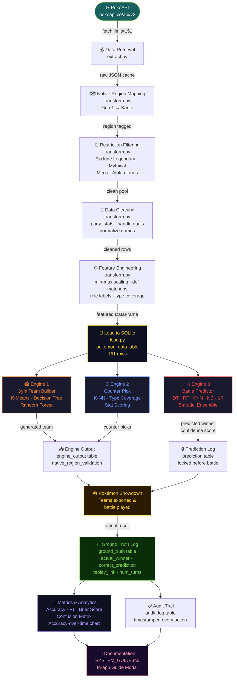

# Pokémon Data Engine — System Guide

> **Version:** 1.0 · **Date:** 2026-05-28  
> **Stack:** Next.js 14 (frontend) · NestJS (backend API) · Python FastAPI (ML service) · SQLite

---

## Table of Contents

1. [System Overview](#1-system-overview)
2. [Starting the System](#2-starting-the-system)
3. [Engine 1 — Gym Leader Team Builder](#3-engine-1--gym-leader-team-builder)
4. [Engine 2 — Counter-Pick Engine](#4-engine-2--counter-pick-engine)
5. [Engine 3 — Battle Predictor](#5-engine-3--battle-predictor)
6. [Battle History & CSV Export/Import](#6-battle-history--csv-exportimport)
7. [Model Metrics](#7-model-metrics)
8. [Pokémon DB](#8-pokémon-db)
9. [Pokémon Showdown Integration](#9-pokémon-showdown-integration)
10. [Backend Logic Notes](#10-backend-logic-notes)
11. [Database Schema Reference](#11-database-schema-reference)
12. [Required Information Checklist](#12-required-information-checklist)

---

## 1. System Overview

The Pokémon Data Engine is a three-engine data mining and machine learning platform that analyses Pokémon battle data. It uses the official Pokémon API as its primary data source and synthetic battle data for model training.

(See Mermaid diagram above for the visual pipeline)

**Service Architecture:**
- **User Browser** (Next.js :3000) → **NestJS API** (:3001) ← business logic, DB reads/writes, audit logging
- **NestJS API** → **SQLite** (`pokemon.db`) ← all persistent state
- **NestJS API** → **Python FastAPI** (:8000) ← all ML computations → `ml/models/` ← serialised model weights (joblib .pkl)

## Data Pipeline Diagram



**Data Sources:**
| Source | Used By | What it Provides |
|--------|---------|-----------------|
| PokeAPI (REST) | Pipeline (`ml/pipeline/`) | 151 Gen 1 Pokémon stats, types, abilities |
| `pokemon.db` | All engines | Pre-enriched Pokémon with scaled stats, role labels, type coverage |
| `ml/data/processed/synthetic_battles.csv` | Engine 3 | 2 000+ synthetic battle outcomes for initial training |
| Battle History (ground truth) | Engine 3 retrain | Real outcomes appended post-battle |

---

## 2. Starting the System

Open **three** terminal windows:

```bash
# Terminal 1 — Python ML service
cd ml
.venv\Scripts\activate          # Windows
uvicorn api.main:app --port 8000 --reload

# Terminal 2 — NestJS backend
cd backend
npm run start:dev

# Terminal 3 — Next.js frontend
cd frontend
npm run dev
```

Open: **http://localhost:3000**

> **Note:** The ML service auto-trains Engine 3 models on first start if `ml/models/` is empty.

---

## 3. Engine 1 — Gym Leader Team Builder

### What It Does
Generates an optimised 6-Pokémon team for a Gym Leader given a type theme and difficulty.

### Navigation
Sidebar → **Gym Team Builder** (#03)

### Inputs
| Field | Values | Notes |
|-------|--------|-------|
| Type Theme | Any of the 18 Pokémon types, or "Balanced" | Filters the pool to matching type_1 or type_2 |
| Difficulty | Easy / Medium / Hard | Controls stat percentile cutoff |

### Difficulty Scaling
| Level | Pool Filter |
|-------|------------|
| Easy | Bottom 0–40th percentile of total_base_stats |
| Medium | 30–70th percentile |
| Hard | Top 60–100th percentile |

### Processing Pipeline (5 stages)

| Stage | Algorithm | Purpose |
|-------|-----------|---------|
| 1. Filter | Type match + difficulty percentile | Narrow pool to eligible Pokémon |
| 2. Cluster | **K-Means** (k=5) on 6 stat features | Group Pokémon into role archetypes |
| 3. Role Assignment | **Decision Tree** (max_depth=5) | Predict role for each Pokémon |
| 4. Usefulness Score | **Random Forest** (50 estimators) | Score top-half by total BST |
| 5. Team Assembly | **Cosine Similarity** + **Gower Distance** | Pick Ace + 5 diverse roles |

### Features Used
`hp`, `attack`, `defense`, `sp_atk`, `sp_def`, `speed` (normalised to [0,1] via MinMaxScaler)

### Model Used
`kmeans+dt+rf+cosine+gower`

### Output
```json
{
  "theme": "fire",
  "difficulty": "hard",
  "team": [
    {
      "slot": 1,
      "role": "ace",
      "name": "arcanine",
      "type_1": "fire",
      "type_2": null,
      "total_base_stats": 555,
      "usefulness_score": 0.8234,
      "reason": "Arcanine (fire, BST 555) selected as ace. Highest cosine similarity (0.94) to fire theme centroid."
    }
    // ... 5 more slots
  ],
  "model_used": "kmeans+dt+rf+cosine+gower",
  "metrics": {
    "silhouette_score": 0.2341,
    "cluster_count": 5,
    "pool_size": 23
  },
  "explanation": "Team built around Fire theme with roles: ..."
}
```

### Metrics Produced
- **Silhouette Score** — cluster quality (0 = random, 1 = perfect separation)
- **Cluster count** and **Pool size** — shown in explanation

### Graphs / Tables
- Team grid (6 cards) with type badges, stat bar, role label
- Cry button (plays PokeAPI `.ogg` audio)

---

## 4. Engine 2 — Counter-Pick Engine

### What It Does
Given an opponent's team (up to 6 Pokémon), recommends the 6 best counter picks from the assigned pool using type effectiveness and stat analysis.

### Navigation
Sidebar → **Counter Pick** (#04)

### Inputs
| Field | Notes |
|-------|-------|
| Pokémon 1–6 | Lowercase names matching the database (e.g. `charizard`, `pikachu`) |

### Processing Pipeline (4 stages)

| Stage | Algorithm | Purpose |
|-------|-----------|---------|
| 1. Score features | Type Coverage Score (TCS), Stat Advantage Score (SAS), Resistance Score (RS) | Rule-based scoring |
| 2. Train models | **K-NN** (k=5), **Decision Tree** (max_depth=4) | Learn "strong counter" classification from pool |
| 3. Composite score | Weighted sum | Rank all candidates |
| 4. Matchup table | TYPE_CHART lookup | Show multipliers for top-3 counters |

### Scoring Formula
```
Final = 0.40 × TCS  +  0.25 × KNN_prob  +  0.20 × SAS_norm  +  0.15 × DT_prob
```

| Component | Weight | Description |
|-----------|--------|-------------|
| TCS | 40% | Type effectiveness score vs opponent team |
| KNN | 25% | K-NN strong-counter probability |
| SAS | 20% | Stat advantage (normalised from [-1,1] to [0,1]) |
| DT | 15% | Decision Tree strong-counter probability |

### Features Used (10-dimensional vector)
`hp`, `attack`, `defense`, `sp_atk`, `sp_def`, `speed` (normalised by stat maxima), `total_base_stats/700`, plus 3 padding zeros.

### Data Source
- Opponent data: `pokemon_data` table (looked up by name)
- Counter candidates: `pokemon_data WHERE is_assigned = 1`

### Model Used
`tcs+knn+dt+gower`

### Output
- **Recommended Counters** (top 6 ranked cards) with score breakdown (TCS%, SAS%, RS%, KNN%, DT%)
- **Type Matchup Table** — matrix of top-6 counters vs all opponents (2×, 1×, <1×, ✗)

### Metrics Produced
- **Counter Success Rate** — `(battles where counter recommendation won) / total counter sessions`
- Per-counter score breakdown visible in the card UI

---

## 5. Engine 3 — Battle Predictor

### What It Does
Before a battle begins, predicts the winner between two trainers using a 5-model ML ensemble. After the battle, records the actual result to evaluate model accuracy and trigger retraining.

### Navigation
Sidebar → **Battle Predictor** (#05)

### Workflow

```
1. Fill TEAM A (trainer name + up to 6 Pokémon)
2. Fill TEAM B (trainer name + up to 6 Pokémon)
3. Click "Predict Winner"
   → match_id generated, prediction locked immediately
4. Battle is played (outside this system)
5. Return to page, find your match, click "Record Actual Result"
   → actual winner + optional replay link saved
   → model auto-retrain triggered
```

### Inputs

**Pre-battle:**
| Field | Required | Notes |
|-------|----------|-------|
| Match ID | Auto-generated | `match_XXXXXXXXXX` format |
| Trainer A Name | Yes | e.g. `Ash` |
| Trainer B Name | Yes | e.g. `Misty` |
| Team A Pokémon (1–6) | Yes | Lowercase, comma-separated |
| Team B Pokémon (1–6) | Yes | |

**Post-battle (Record Result):**
| Field | Required | Notes |
|-------|----------|-------|
| Actual Winner | Yes | Must match one of the trainer names |
| Replay Link | Optional | Pokémon Showdown replay URL (see §9) |
| Screenshot Link | Optional | Imgur or direct image URL |
| Final Score | Optional | e.g. `6-3` |

### ML Model (5-model Ensemble)

| Model | Weight | Type |
|-------|--------|------|
| Decision Tree (max_depth=6) | 15% | `sklearn` |
| Random Forest (100 estimators) | 35% | `sklearn` |
| Logistic Regression (max_iter=1000) | 20% | `sklearn` |
| Gaussian Naive Bayes | 10% | `sklearn` |
| K-Nearest Neighbours (k=5) | 20% | `sklearn` |

**Ensemble method:** Majority vote for winner; weighted probability average for confidence.

### Features Used (10 differential features — Team A minus Team B)

| Feature | Description |
|---------|-------------|
| `speed_adv` | Mean speed difference |
| `stat_adv` | Total BST sum difference |
| `coverage_adv` | Type coverage fraction difference |
| `weakness_adv` | Total weakness count difference |
| `hp_adv` | Mean HP difference |
| `atk_adv` | Mean Attack difference |
| `sp_atk_adv` | Mean Special Attack difference |
| `def_adv` | Mean Defense difference |
| `type_diversity_adv` | Unique type count difference |
| `role_balance_a` | 1 if Team A covers all 5 roles, else 0 |

### Training Data
- Primary: `ml/data/processed/synthetic_battles.csv` (2 000+ rows, generated by `ml/pipeline/generate_synthetic_battles.py`)
- Retrain: each new ground truth battle is appended to the CSV and all 5 models are retrained

### Model Persistence
Models serialised to `ml/models/engine3_*.pkl` via `joblib`. Loaded into an in-process cache on first request.

### Output
```json
{
  "match_id": "match_1779941353133",
  "battler_a": "Ash",
  "battler_b": "Misty",
  "predicted_winner": "Ash",
  "confidence": 0.8432,
  "reason": "Team Ash wins due to: speed advantage, stat advantage, coverage advantage.",
  "model_votes": { "dt": "Ash", "rf": "Ash", "lr": "Ash", "nb": "Misty", "knn": "Ash" },
  "is_locked": 1,
  "timestamp": "2026-05-28T04:09:00.000Z"
}
```

### Metrics Used
| Metric | Description |
|--------|-------------|
| Accuracy | Correct predictions / total evaluated |
| Precision | TP / (TP + FP) |
| Recall | TP / (TP + FN) |
| F1 Score | Harmonic mean of precision and recall |
| Brier Score | Mean squared probability error (lower = better) |
| Log Loss | Cross-entropy of probability predictions (lower = better) |
| Confusion Matrix | TP / FP / FN / TN |

### Graphs / Tables Produced
- Accuracy over time chart (requires ≥2 evaluated battles)
- Confusion matrix with battle terminology (Super Effective / Critical Hit / Missed / Dodged)
- Per-model accuracy breakdown

---

## 6. Battle History & CSV Export/Import

### Navigation
Sidebar → **Battle History** (#06)

### What It Shows
All predictions joined with ground truth results:
- Match ID, Battlers, Predicted Winner, Confidence
- Actual Winner (or "Pending" if not yet recorded)
- Result badge (✅ Correct / ⏳ Pending / ❌ Wrong)
- Timestamp, Replay link

### CSV Export

Click **⬇ Export CSV** to download `battle_history_<timestamp>.csv`.

**CSV Columns:**
```
Match ID, Battler A, Battler B, Predicted Winner, Confidence, Actual Winner, Correct, Replay, Timestamp
```

**Example row:**
```csv
"match_1779941353133","Ash","Misty","Ash","84.3","Ash","yes","","2026-05-28 04:09:00"
```

### CSV Import (Manual Process)

> **Note:** Direct CSV import is not yet available through the UI. To import battle data from an external CSV, use the API directly:

**Step 1** — Predict (creates the locked prediction record):
```bash
curl -X POST http://localhost:3001/api/engine3/predict \
  -H "Content-Type: application/json" \
  -d '{
    "match_id": "your-unique-match-id",
    "battler_a": "TrainerA",
    "battler_b": "TrainerB",
    "team_a": ["charizard", "pikachu"],
    "team_b": ["blastoise", "rhydon"]
  }'
```

**Step 2** — Record Result (if battle has already been played):
```bash
curl -X POST http://localhost:3001/api/engine3/result \
  -H "Content-Type: application/json" \
  -d '{
    "match_id": "your-unique-match-id",
    "actual_winner": "TrainerA",
    "replay_link": "https://replay.pokemonshowdown.com/gen9ou-123456789",
    "final_score": "6-3"
  }'
```

**Bulk import script** (Node.js, run from project root):
```js
// scripts/import-battles.js
const fs = require('fs');
const csv = require('csv-parse/sync');

const rows = csv.parse(fs.readFileSync('battles.csv'), { columns: true });

for (const row of rows) {
  // POST predict then POST result for each row
  // See API docs above
}
```

### Important Rules
1. **Predictions are immutable** — once created, the predicted winner cannot be changed
2. **Match IDs must be unique** — duplicate match IDs will return a `409 Conflict` error
3. The Correct field in the CSV reflects `actual_winner.toLowerCase() === predicted_winner.toLowerCase()`

---

## 7. Model Metrics

### Navigation
Sidebar → **Model Metrics** (#07)

### What It Shows

**Performance Metrics Panel:**
| Metric | Game Label | Meaning |
|--------|-----------|---------|
| Accuracy | "SUPER EFFECTIVE!" | % of predictions correct |
| Precision | "CRITICAL HIT!" | Of all A-wins predicted, how many were right |
| Recall | "IT'S EFFECTIVE!" | Of all actual A-wins, how many did we catch |
| F1 Score | "COMBO ATTACK!" | Balance of precision and recall |
| Brier Score | "NOT VERY EFFECTIVE…" | Probability calibration quality |
| Log Loss | "WILD MISS?" | Penalty for overconfident wrong predictions |

**Summary Stats:** Total battles evaluated, correct count, incorrect count, win rate

**Engine 2 Counter Success Rate:** How often Engine 2's recommendations won

**Confusion Matrix:**
| Cell | Label | Meaning |
|------|-------|---------|
| TP | Super Effective! | Predicted A wins → A won ✓ |
| FP | Not Very Effective… | Predicted A wins → B won ✗ |
| FN | Missed! | Predicted B wins → A won ✗ |
| TN | Dodged! | Predicted B wins → B won ✓ |

**Accuracy Over Time:** Line chart showing rolling accuracy as battles accumulate (requires ≥2 evaluated battles)

### Metric Source
Metrics prefer the ML service's computed values (from `GET /api/engine3/accuracy`) and fall back to DB-computed values when the ML service is unavailable.

---

## 8. Pokémon DB

### Navigation
Sidebar → **Pokémon DB** (#02)

### What It Shows
Full table of all 151 Gen 1 Pokémon with:
- PokeAPI sprite
- Name, Type badges
- All 6 base stats + Total
- Role label, Speed tier
- Weakness count, Resistance count
- Assignment status

### Filtering
- Search by name
- Filter by type
- Filter by role (sweeper / tank / wall / support / balanced)

### Data Source
Populated by the ETL pipeline (`ml/pipeline/`) from the PokeAPI:
1. **Extract** (`extract.py`) — fetch all 151 Pokémon from `https://pokeapi.co/api/v2/`
2. **Transform** (`transform.py`) — compute scaled stats, role labels, type coverage, weakness scores
3. **Load** (`load.py`) — insert into `pokemon_data` SQLite table

---

## 9. Pokémon Showdown Integration

[Pokémon Showdown](https://pokemonshowdown.com) is an online Pokémon battle simulator. The system is **designed to accept Showdown replay links** in the ground truth recording step.

### Current Integration
The `replay_link` field on `ground_truth` stores a Showdown URL, e.g.:
```
https://replay.pokemonshowdown.com/gen9ou-1234567890
```
This link appears as a **"View →"** button in the Battle History table.

### Replay URL Format
```
https://replay.pokemonshowdown.com/{format}-{battle-id}
```
Common formats: `gen9ou`, `gen9randombattle`, `gen9vgc2024`, `gen1ou`

### How to Use It
1. Play your battle on Pokémon Showdown
2. At the end, click **"Upload and share replay"**
3. Copy the replay URL (e.g. `https://replay.pokemonshowdown.com/gen9ou-123456`)
4. Paste it into the **Replay Link** field when recording your battle result

### Planned Extensions
The system is ready for deeper integration:

| Feature | How It Would Work |
|---------|------------------|
| Auto-parse winner | Fetch `https://replay.pokemonshowdown.com/{id}.json` → extract `p1rating` / `p2rating` and last line of the log |
| Auto-import team | Parse the Showdown team export format (6 lines per Pokémon) to auto-fill team_a / team_b |
| Auto-record result | Webhook or polling — detect when a replays link is posted, parse outcome, auto-fill ground truth |

### Showdown Team Format (for reference)
```
Pikachu @ Light Ball
Ability: Static
Level: 50
EVs: 252 SpA / 4 SpD / 252 Spe
Timid Nature
- Thunderbolt
- Volt Switch
- Hidden Power Ice
- Nasty Plot
```
The system currently stores teams as a list of Pokémon names. Full moveset/ability data is a planned extension.

---

## 10. Backend Logic Notes

### API Endpoints Reference

| Method | Path | Description |
|--------|------|-------------|
| GET | `/api/pokemon` | All 151 Pokémon |
| GET | `/api/pokemon/assigned` | Assigned pool only |
| POST | `/api/engine1/generate` | Generate gym team |
| POST | `/api/engine2/counter` | Get counter picks |
| GET | `/api/engine2/success-rate` | Counter success rate |
| POST | `/api/engine3/predict` | Predict battle winner |
| POST | `/api/engine3/result` | Record actual result |
| GET | `/api/engine3/history` | All predictions + results |
| GET | `/api/engine3/accuracy` | Model metrics |
| GET | `/api/audit` | Audit log entries |

### Prediction Lock Mechanism
Once a prediction is created via `POST /api/engine3/predict`, it is **immediately locked** (`is_locked = 1`). This prevents post-hoc manipulation of predictions to inflate accuracy scores.

The lock is enforced at the database level via the `is_locked` column. Any attempt to re-predict with the same `match_id` returns `409 Conflict`.

### Audit Trail
Every INSERT, PREDICT, LOCK, and BATTLE_END is written to `audit_log`. This creates a tamper-evident chain for data integrity.

### Auto-Retrain
When a ground truth result is recorded (`POST /api/engine3/result`):
1. The new battle's feature vector is computed
2. Appended to `ml/data/processed/synthetic_battles.csv`
3. All 5 Engine 3 models are retrained immediately
4. Models are saved to `ml/models/*.pkl`
5. In-process cache is refreshed

This is non-fatal — if retrain fails, the ground truth is still saved.

### Known Bug: Metrics Function
In `ml/engines/engine3_battle_predictor.py`, the `get_metrics()` function reads the CSV with:
```python
y = (df["winner"] == "A").astype(int).values
```
But the CSV stores winner as integers `0` (A wins) / `1` (B wins), not strings. This makes the comparison always `False` on integer data. The `train()` function handles this correctly with a dtype check — `get_metrics()` needs the same fix:
```python
# Fix needed in get_metrics():
raw_winner = df["winner"]
if raw_winner.dtype == object or raw_winner.dtype.kind in ("U", "S"):
    y = (raw_winner.str.upper() == "A").astype(int).values
else:
    y = (raw_winner.astype(int) == 0).astype(int).values
```

---

## 11. Database Schema Reference

### Tables

| Table | Primary Key | Description |
|-------|-------------|-------------|
| `pokemon_data` | `pokemon_id` | All Pokémon with stats, types, roles |
| `engine_output` | `engine_id` | Saved outputs from all 3 engines |
| `prediction` | `match_id` | Pre-battle predictions (locked on create) |
| `ground_truth` | `id` | Post-battle actual results |
| `audit_log` | `audit_id` | Immutable action log |

### View: `v_prediction_accuracy`
Joins `prediction` and `ground_truth`. Aliases:
- `prediction.timestamp` → `predicted_at`
- `ground_truth.timestamp` → `result_at`

Use `predicted_at` / `result_at` in all frontend queries (not `.timestamp`).

### is_assigned Flag
In `pokemon_data`, `is_assigned = 1` marks Pokémon available to Engine 2.
Default: 0 (all Pokémon unassigned until the pipeline or manual assignment sets this).

---

## 12. Required Information Checklist

### Engine 1 — Gym Leader Team Builder

| Requirement | Detail |
|------------|--------|
| **Engine name** | Gym Leader Team Builder |
| **Engine type** | Clustering + Classification + Scoring |
| **Purpose** | Generate a themed, balanced 6-Pokémon Gym Leader team optimised for a given type and difficulty level |
| **Data source** | `pokemon_data` SQLite table (loaded via NestJS → Python) — sourced from PokeAPI |
| **Model used** | K-Means (k=5), Decision Tree (max_depth=5), Random Forest (50 estimators), Cosine Similarity, Gower Distance |
| **Features used** | hp, attack, defense, sp_atk, sp_def, speed (all scaled to [0,1]) |
| **Processing pipeline** | Filter by type → Filter by difficulty percentile → K-Means cluster → DT role assignment → RF usefulness score → Cosine ace selection → Gower diversity assembly |
| **Recording method** | Results saved to `engine_output` table with `engine_type = 'gym_leader'` |
| **Output** | 6-slot team JSON: name, type, role, BST, usefulness score, reason |
| **Engine logic** | Clusters pool into role archetypes, assigns roles via DT, scores usefulness via RF, selects ace by cosine proximity to theme centroid, fills remaining slots maximising Gower diversity |
| **Metrics used** | Silhouette score (cluster quality) |
| **Graphs/tables** | 6-card team grid with type badges, stat bars, role labels, audio cry buttons |

### Engine 2 — Counter-Pick Engine

| Requirement | Detail |
|------------|--------|
| **Engine name** | Counter-Pick Engine |
| **Engine type** | Type-effectiveness scoring + ML classification |
| **Purpose** | Recommend the 6 best Pokémon from the assigned pool to counter a given opponent team |
| **Data source** | `pokemon_data` (opponent lookup + assigned pool), TYPE_CHART constant |
| **Model used** | K-NN (k=5), Decision Tree (max_depth=4), Type Coverage Score (rule-based) |
| **Features used** | 10-dim vector: normalised stats + total BST; TCS, SAS, RS computed separately |
| **Processing pipeline** | Lookup opponent data → Load assigned pool → Train KNN+DT on TCS threshold → Score all candidates → Weighted rank → Build matchup table |
| **Recording method** | Results saved to `engine_output` table with `engine_type = 'counter_pick'` |
| **Output** | Top-6 counter cards with rank, score breakdown (TCS/SAS/RS/KNN/DT), type badge, reason text |
| **Engine logic** | Computes type-effectiveness, stat advantage, and resistance scores per candidate; trains KNN and DT on "is strong counter" binary label; final score is weighted sum |
| **Metrics used** | Counter Success Rate (wins / total sessions) |
| **Graphs/tables** | Ranked counter cards with score bars; full type matchup matrix (coloured by 4×/2×/1×/<1×/immune) |

### Engine 3 — Battle Predictor

| Requirement | Detail |
|------------|--------|
| **Engine name** | Battle Predictor |
| **Engine type** | Multi-model supervised ensemble |
| **Purpose** | Predict the winner of a 2-trainer Pokémon battle before it occurs; record actual outcome for ongoing model evaluation |
| **Data source** | `pokemon_data` (team stats), `synthetic_battles.csv` (training), `ground_truth` (retraining) |
| **Model used** | Decision Tree, Random Forest, Logistic Regression, Gaussian Naive Bayes, K-NN (5-model ensemble, majority vote + weighted confidence) |
| **Features used** | 10 differential features: speed_adv, stat_adv, coverage_adv, weakness_adv, hp_adv, atk_adv, sp_atk_adv, def_adv, type_diversity_adv, role_balance_a |
| **Processing pipeline** | Build team feature vectors → Compute 10 differential features → Run 5 models → Majority vote → Weighted confidence → Persist prediction → Lock → Trigger retrain on result |
| **Recording method** | Predictions locked in `prediction` table; outcomes in `ground_truth` table; `v_prediction_accuracy` view joins both |
| **Output** | Predicted winner (trainer name), confidence %, reason text, per-model vote breakdown |
| **Engine logic** | Each model votes A or B; majority determines winner; confidence is the weighted probability of the winning side from models with predict_proba; new ground truth appended to CSV and all models retrained |
| **Metrics used** | Accuracy, Precision, Recall, F1 Score, Brier Score, Log Loss, Confusion Matrix (TP/FP/FN/TN) |
| **Graphs/tables** | Accuracy-over-time line chart; confusion matrix with battle terminology; per-model accuracy breakdown |

---

*Generated by Claude Code — Pokémon Data Engine System Guide v1.0*
